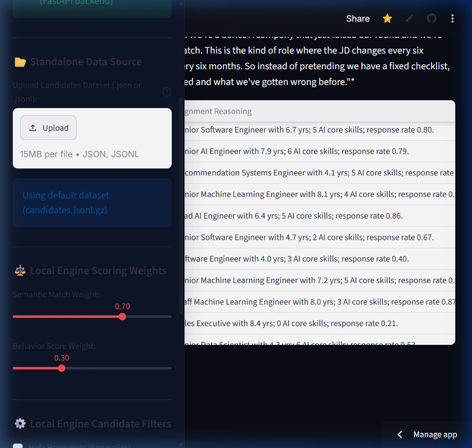
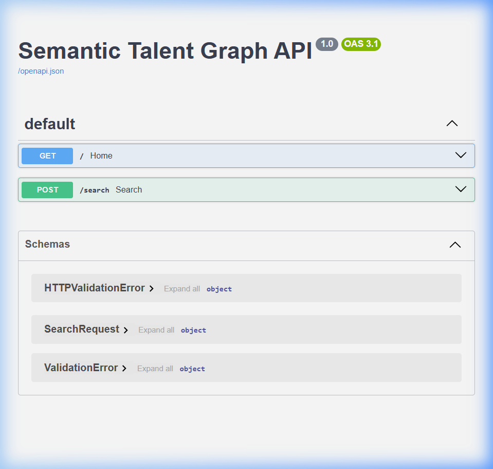

# Semantic Talent Graph

AI-powered semantic candidate discovery, ranking, and verification system built for the India Runs x Redrob Hackathon.

🚀 **Live Streamlit App (Frontend):** [semantic-talent-graph-tvakmfarz76p2hggiyv5ft.streamlit.app](https://semantic-talent-graph-tvakmfarz76p2hggiyv5ft.streamlit.app/)
🌐 **Live Hugging Face Space (Backend API):** [harshverma27/semantic-talent-backend](https://huggingface.co/spaces/harshverma27/semantic-talent-backend) (API Endpoint: `https://harshverma27-semantic-talent-backend.hf.space`)

---

## 📸 Project Screenshots

### 1. Recruiter Search & Candidate Ranking Dashboard (Frontend Streamlit)


### 2. Operational FastAPI API Status (Hugging Face Space Backend)


---

## 🎯 What We Are Trying to Achieve

In traditional applicant tracking systems (ATS), recruiters suffer from two main issues:
1. **Keyword stuffing** and fake resumes (Honeypots) that bypass simple boolean filters.
2. **Static search** that misses candidates with highly relevant transferable skills but slightly different job titles.

**Semantic Talent Graph** solves this by:
* **Semantic Refiner:** Using high-dimensional TF-IDF vectorization and cosine similarity to match candidates on conceptual fit rather than literal keywords.
* **Redrob Behavioral Engine:** Scoring candidates on actual platform activity (response rates, profile completeness, interview attendance, GitHub commits).
* **Honeypot Detection:** Running multi-point checks to flag anomaly profiles (e.g. impossible years of experience vs. job duration, duplicated skills, empty text blocks).

---

## 🏗️ Technical Architecture

The project is split into three main components:

```
                  ┌──────────────────────────────────────────────┐
                  │                 RECRUITER                    │
                  └──────────────┬───────────────────────────────┘
                                 │
                        [Search Query / Filters]
                                 ▼
┌─────────────────────────────────────────────────────────────────────────────────┐
│                           FRONTEND (harsh-ui)                                   │
│  - Streamlit dashboard with rich custom HSL dark styling & interactive cards.   │
│  - Weighted sliders (Semantic similarity weight vs. Behavioral score weight).  │
│  - Direct filters (Min Experience, Min Behavior Score, Education Tiers).        │
│  - Prominent "Honeypot Detection Passed/Flagged" warning system.                 │
│  - 1-Click CSV Export button auto-formatted and padded to exactly 100 rows.     │
└────────────────────────┬────────────────────────────────┬───────────────────────┘
                         │                                │
                 [Processed Pool]                 [Cosine Similarity]
                         ▼                                ▼
┌──────────────────────────────────────────┐    ┌─────────────────────────────────┐
│        BACKEND (vanshika-backend)        │    │    REFINER (swapna-refiner)     │
│  - Candidate ingestion (JSON/JSONL).     │    │  - TF-IDF Vectorizer & Cosine   │
│  - Profile Completeness calculations.    │    │    Similarity.                  │
│  - Anomaly & Honeypot detection scoring.  │    │  - Composite weighted ranker.   │
│  - Core data loading & parsing.          │    │  - Semantic explanation reasoning.│
└──────────────────────────────────────────┘    └─────────────────────────────────┘
```

### 1. Frontend (`harsh-ui`)
The user interface is built using Streamlit and styled with premium custom CSS (dark mode, glassmorphism, responsive grids). It maps the official Candidate Profile Schema to interactive components:
* **Employment Tabs:** Accordion views showing detailed timeline and descriptions of past jobs.
* **Academic Tabs:** Displays graduation institutions, tiers (Tier 1-4), and grades.
* **Redrob Signals:** A custom metric grid detailing candidate response rates, connections, GitHub score, and expected salary.
* **Interactive Controls:** Recruiters can adjust the ranking weights dynamically in the sidebar.

### 2. Backend (`vanshika-backend`)
Responsible for loading the raw database and computing safety/trust scores:
* **Behavioral Analysis (`behavior.py`):** Calculates an engagement score (0-100) using weights from profile completeness, open to work flags, github activity, recruiter response rate, and offer acceptance history.
* **Honeypot Checks (`honeypot.py`):** Detects discrepancies like keyword stuffing, empty profiles, or impossible experience (i.e. claiming more experience than the sum of all career history).
* **Data Processing (`preprocess.py`):** Normalizes, cleans punctuation, and merges candidate resume nodes into a single text corpus.

### 3. Refiner / Ranking (`swapna-refiner`)
Bridges backend parsing and frontend search queries:
* **Vectorization (`ranking.py`):** Fits a TF-IDF vectorizer over the corpus of cleaned text and transforms search terms.
* **Matching:** Evaluates cosine similarity of vectors to find true conceptual relevance.
* **Adjustment & Alignment:** Combines semantic similarity (70% weight) and behavioral engagement (30% weight), scaling the final composite score to the `[0.0, 1.0]` range with 4 decimal places for challenge spec compliance (with top candidates scoring near 0.8). Supports lexicographical tie-breaking on candidate IDs.

---

## 📂 Project Structure

```
semantic-talent-graph/
├── frontend/
│   ├── app.py              # Streamlit Entry point (renders dashboard, sidebar, search)
│   └── components.py       # Custom premium UI card widgets and custom HSL CSS styling
├── backend/
│   ├── data/
│   │   ├── sample_candidates.json   # Sample official-schema candidate data
│   │   ├── job_description.docx     # Job description file supplied by organizers
│   │   └── validate_submission.py   # Organizer script to validate submission format
│   ├── preprocess.py       # Candidate loading, cleaning, and text combining
│   ├── behavior.py         # Engagement scoring rules
│   ├── honeypot.py         # Anomaly rules (impossible experience, stuffing checks)
│   ├── ranking.py          # TF-IDF semantic matcher & reasoning engine
│   └── test_*.py           # Backend validation unit tests
├── requirements.txt        # Combined requirements (Streamlit, Scikit-learn, docx, pandas)
└── rank.py                 # CLI tool that generates the submission.csv
```

---

## ⚡ Setup & Local Execution

### 1. Installation
Install all dependencies (Streamlit, scikit-learn, python-docx, pandas, numpy) from root:
```bash
pip install -r requirements.txt
```

### 2. Run the Dashboard App
Start the Streamlit local dashboard:
```bash
streamlit run frontend/app.py
```
Open **[http://localhost:8501](http://localhost:8501)** in your browser. By default, it loads the full 100K candidates dataset (`candidates.jsonl.gz`) and the default query from `job_description.docx` (truncated on a sentence boundary). You can upload a custom JSON/JSONL dataset (up to 15MB) in the sidebar.

### 3. Run the CLI Ranker (Validator Compliant)
To output a submission file compliant with the hackathon validation scripts using the full 100K dataset:
```bash
python rank.py --candidates ./backend/data/candidates.jsonl.gz --out submission.csv
```
This runs the full preprocessing and ranking pipeline using the organizers' job description, and saves the top 100 candidates sorted in decreasing score order into `submission.csv`.

### 4. Validate the Submission Format
Run the organizers' validation script on your generated CSV:
```bash
python backend/data/validate_submission.py submission.csv
```
*Expected output: `Submission is valid.`*
